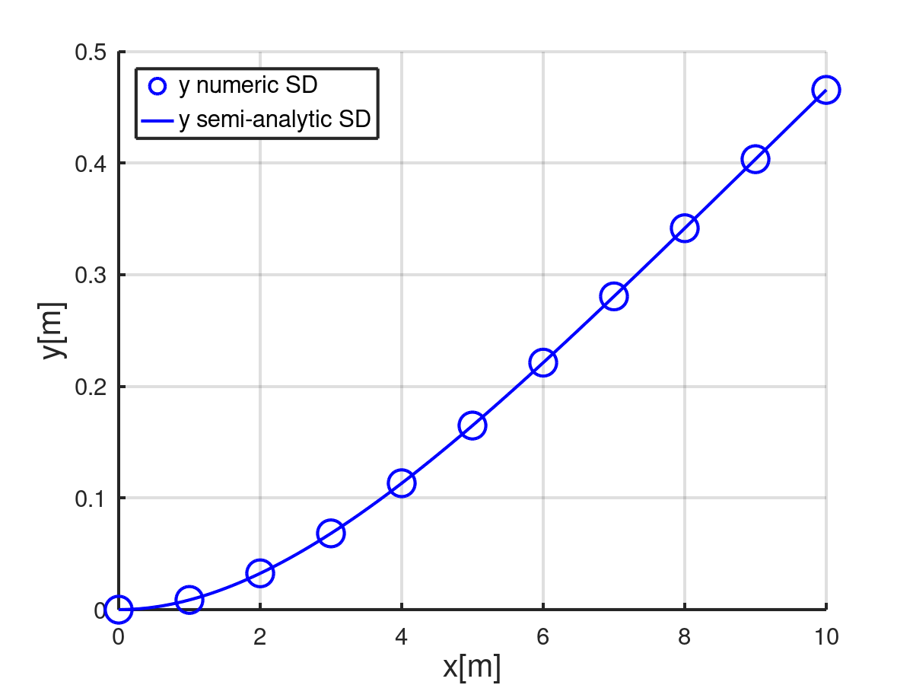
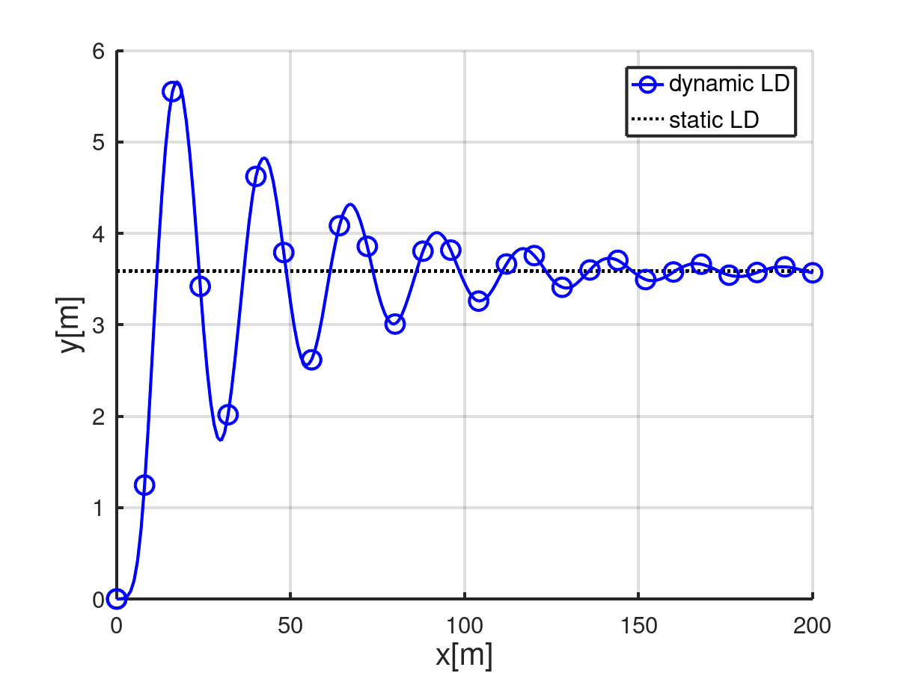

# Aerodynamic non-linear cantilever beam example
--------------------
 In this tutorial, the aerodynamic non-linear cantilever beam example is solved using ONSAS. The aim of this problem is to validate aerodynamic steady wind loads applied to a cantilever beam undergoing small strains. The aerodynamic force modification due to the beam deformation is considered (drag reconfiguration). Given the aforementioned characteristics and under the hypothesis of small displacements regime a semi-analytic solution is available.   

 The beam is submitted to a uniform air wind velocity field $V_a$, at 20 degrees and atmospheric pressure, along axis $y$. Due to revolution symmetry of the problem lift $c_l$ and torsional moment $c_m$ coefficients are null. A drag coefficient $c_d=1.2$ is extracted from [this reference](https://www.cambridge.org/core/journals/journal-of-fluid-mechanics/article/abs/experiments-on-the-flow-past-a-circular-cylinder-at-very-high-reynolds-number/7859A6C46BF4B0F43F11F52AE1C60150). 
The beam has a length $L$ and a circular solid cross section with diameter $d$ as it is shown in the following figure: 

```@raw html

```
The Octave script of this example is available at [this url](https://github.com/ONSAS/ONSAS.m/blob/master/examples/nonLinearCantileverAero/nonLinearCantileverAero.m).
## Small displacements 2D case
--------------------

### Static semi-analytic solution

 The wind load forces of a generic cross section can be derived within the quasi-steady-theory. Considering a cross section located at $x$, then the projected wind velocity into the transverse deformed plane is then  $V_p=V_acos(\theta_z)$ (the axial drag is neglected). Subsequently a drag force per unit of length $F_d= \frac{1}{2} \rho d c_d ||V_p||^2$ with $\frac{V_p}{||V_p||}$ direction is applied. In order to link the force $F_d$ with the beam deflection, the uniform distributed force along $y$ is computed as $F_y=F_d.cos(\theta_z)$. This leads to the following third order differential equation:

 * $EI_{zz} \frac{\partial ^3 \theta_z}{\partial x ^3} = -q_0 c_d\cos^3(\theta_z)$
 in which $q_0 = \frac{1}{2} \rho_f d ||V_a||^2$ and the air density is $\rho_f = 1.225$ kg/m$^3$.
### Numerical solution
---------------------

 Before defining the structs, the workspace is cleaned and ONSAS directory is added:
```
close all, clear all ; addpath( genpath( [ pwd '/../../src'] ) );
```
 material and geometrical parameters are defined:
```
E = 1e9 ;  nu = 0.3 ; rho = 1800 ; G = E / (2 * (1+nu)) ;
l = 10 ; d = l/100 ; J = pi * d ^ 4 / 32 ; Iyy = J / 2 ; Izz = Iyy ;  
```
 next the number of frame elements for all cases is set:
```
numElements = 10 ;
```
### MEBI parameters

### materials
 Since the example contains only one linear Euler Bernoulli element the fields of the `materials` struct will have only one entry. Although, the constitutive behavior law selected is Saint-Venant-Kirchhoff:
```
materials.hyperElasModel  = 'linearElastic' ;
materials.hyperElasParams = [ E nu ]        ;
```
 note that the use of  this linear elastic element guarantees the left hand side of the differential equation stated above.

### elements

 Two different types of elements are considered, node and frames. The nodes will be assigned in the first entry (index $1$) and the beam at the index $2$. The _elemType_ field is then:
```
elements(1).elemType = 'node'  ;
elements(2).elemType = 'frame' ;
```
 The node has not cross section geometry to assign (an empty array is automatically set). The solid circular cross section is preset in ONSAS, and to load it just use:
```
elements(2).elemCrossSecParams{1,1} = 'circle' ;
elements(2).elemCrossSecParams{2,1} = d        ;
```
 Now the element aerodynmamic properties are defined. First the drag coefficient function located at the folder's example is declared into _userDragCoef_ field as:
```
elements(2).userDragCoef   = 'dragCoefCircular'   ;
```
 Next the _elemTypeAero_ field contains the information of the chord vector. This vector is defined first considering the orientation of the cross section set up for drag experiments. According to the revolution symmetry of the problem the chord vector orientation has no impact into drag force vector, since $c_d$ is constant any angle of incidence. However the characteristic dimension of the circular cross section is declared into the norm of the chord vector ( first three entries of _elemTypeAero_ field into `elements` struct ) as: 
```
numGaussPoints           = 4 ;
elements(2).elemTypeAero = [0 d 0 numGaussPoints ] ;
```
 also 4 number of integration Gauss points are employed to compute each element aerodynamic force vector.

### boundaryConds

 Only one welded (6 degrees of freedom are set to zero) boundary condition (BC) is considered:
```
boundaryConds(1).imposDispDofs = [ 1 2 3 4 5 6 ] ;
boundaryConds(1).imposDispVals = [ 0 0 0 0 0 0 ] ;
```

### initial Conditions
 Any non-homogeneous initial conditions are considered, then an empty struct is set:
```
initialConds = struct() ;
```

### mesh parameters
The coordinates of the mesh nodes are given by the matrix:
```
mesh.nodesCoords = [ (0:(numElements))'*l/numElements  zeros(numElements+1,2) ] ;
```
The connectivity is introduced using the _conecCell_. Each entry of the cell contains a vector with the four indexes of the MEBI parameters, followed by the indexes of nodes that compose the element (node connectivity). For didactical purposes each element entry is commented. First the cell is initialized:
```
mesh.conecCell = { } ;
```
 then the first welded node is defined with material (M) zero since nodes don't have material, the first element (E) type (the first entry of the `elements` struct), and (B) is the first entry of the the `boundaryConds` struct. For (I) no non-homogeneous initial condition is considered (then zero is used) and finally the node is assigned:
```
mesh.conecCell{ 1, 1 } = [ 0 1 1 0  1 ] ;
```
 Next the frame elements MEBI parameters are set. The frame material is the first material of `materials` struct, then $1$ is assigned. The second entry of the `elements` struct correspond to the frame element employed, so $2$ is set. Finally no BC and no IC is required for this element, then $0$ is used.  Consecutive nodes build the element so then the `mesh.conecCell` is:
```
for i=1:numElements,
  mesh.conecCell{ i+1,1 } = [ 1 2 0 0  i i+1 ] ;
end
```

### analysisSettings

 First the wind velocity function name is set into _userWindVel_ field of `analysisSettings` struct. This will apply a external wind loads for each element with _elemTypeAero_ field into the `elements` struct. The name of the wind velocity function located on the same example path is: 
```
analysisSettings.userWindVel = 'windVelNonLinearStatic' ;
```
 Inside that function a linear velocity $v_a = 30*t$ is declared. The final time will be set to $1$ in order to achieve 30 m/s.
 The geometrical non-linear effects are considered in this case to compute the aerodynamic force. As consequence the wind load forces are computed on the deformed configuration. The field  _geometricNonLinearAero_ into  `analysisSettings` struct is then set to:
```
analysisSettings.geometricNonLinearAero = true;
```
  note that if this boolean is not declared ONSAS will automatically assign it as true. 
 since this problem is static, then a N-R method is employed. The convergence of the method is accomplish with ten equal load steps. The time variable for static cases is a load factor parameter that must be configured into the `windVel.m` function. A linear profile is considered for ten equal velocity load steps as:
```
analysisSettings.deltaT        =   0.1           ;
analysisSettings.finalTime     =   1             ;
analysisSettings.methodName    = 'newtonRaphson' ;
```
 Next the maximum number of iterations per load(time) step, the residual force and the displacements tolerances are set to: 
```
analysisSettings.stopTolDeltau =   1e-6          ;
analysisSettings.stopTolForces =   1e-6          ;
analysisSettings.stopTolIts    =   40            ;
```

### otherParams
 The name of the problem and vtk format output are selected: 
```
otherParams.problemName = 'nonLinearCantileverSD2D';
otherParams.plotsFormat = 'vtk' ;
```

 ONSAS software is executed for the parameters above defined and the displacement solution of each load(time) step is saved into matUsSD matrix:
```
[matUsSD, ~] = ONSAS( materials, elements, boundaryConds, initialConds, mesh, analysisSettings, otherParams ) ;
```
 
### Verification
---------------------

### DifferentialEquations.jl (reconfiguration) solution.

 DiffEq.jl solves the third order ordinary differential equation for this case by executing [DiffEq.jl script](https://github.com/ONSAS/ONSAS.m/blob/master/examples/nonLinearCantileverAero/DiffEq.jl). Then  [`assembleJuliaSol.m` script](https://github.com/ONSAS/ONSAS.m/blob/master/examples/nonLinearCantileverAero/assembleJuliaSol.m) function is executed to build the julia solution with `mesh` and `elements` struct as:
```
[dSolJulia] = assembleJuliaSol(elements,mesh) ;
```
 Then the the relevance linear and angular displacements are extracted using:
```
ydefJulia = dSolJulia(3:6:end)              ;
thetaZdefJulia = dSolJulia(6:6:end)         ;
xdefJulia = linspace(0,l,length(ydefJulia)) ;
```

### Numeric solution

 The numerical solution is computed:
```
xref    = mesh.nodesCoords(:,1)       ;
yref    = mesh.nodesCoords(:,2)       ;
zref    = mesh.nodesCoords(:,3)       ;
xdefNum = xref + matUsSD(1:6:end,end) ;
ydefNum = yref + matUsSD(3:6:end,end) ;
thetaZdefNum = matUsSD(6:6:end,end)   ;
```

### Plot verification

 The plot parameters are:
```
lw = 2 ; ms = 12 ;
labelTitle = [' Validating solution with ' num2str(numElements) ' elements' ] ;
axislw = 2 ; axisFontSize = 20 ; legendFontSize = 15 ; curveFontSize = 15 ;    
folderPathFigs = './output/figs/' ;
mkdir(folderPathFigs) ;
```
 The linear $u_y$ displacements verification is plotted executing:  
```
fig1 = figure(1) ;
hold on, grid on
plot(xref      , ydefNum  , 'bo' , 'linewidth', lw, 'markersize', ms+5   );
plot(xdefJulia , ydefJulia, 'b-' , 'linewidth', lw, 'markersize', ms     );
legend('y numeric SD', 'y semi-analytic SD' )
labx=xlabel(' x[m] ');    laby=ylabel('y[m]');
set(legend, 'linewidth', axislw, 'fontsize', legendFontSize, 'location','northWest' ) ;
set(gca, 'linewidth', axislw, 'fontsize', curveFontSize ) ;
set(labx, 'FontSize', axisFontSize); set(laby, 'FontSize', axisFontSize) ;
namefig1 = strcat(folderPathFigs, 'linDispSD.png') ;
print(fig1, namefig1,'-dpng') ;
```

```@raw html

```

 The angular $\theta_z$ displacements verification is plotted executing:  
```
fig2 = figure(2) ;
hold on, grid on
plot(xref,      thetaZdefNum,      'bo' , 'linewidth', lw,'markersize', ms+5   );
plot(xdefJulia, thetaZdefJulia,    'b-' , 'linewidth', lw, 'markersize', ms    );
legend('\theta_z numeric SD', '\theta_z semi-analyitc SD')
labx=xlabel(' x[m] ');    laby=ylabel('Angle[rad]');
% title (labelTitle)
set(legend, 'linewidth', axislw, 'fontsize', legendFontSize, 'location','northWest' ) ;
set(gca, 'linewidth', axislw, 'fontsize', curveFontSize ) ;
set(labx, 'FontSize', axisFontSize); set(laby, 'FontSize', axisFontSize) ;
namefig2 = strcat(folderPathFigs, 'angDispSD.png') ;
print(fig2, namefig2,'-dpng')
```

```@raw html

```

## Large displacements 2D case
--------------------
 Now a large displacements 2D case is solved. The solution is computed using the co-rotational beam element formulation proposed in [this reference](https://www.sciencedirect.com/science/article/abs/pii/S0045782513003022)
### Numerical solution static case
---------------------
### MEBI parameters
---------------------

### materials
 In order to reproduce large displacements results the `materials` struct is then changed to: 
```
materials.hyperElasModel  = '1DrotEngStrain' ;
materials.hyperElasParams = [ 1e8 nu ]       ;
materials.density         = rho              ;
```

### elements
 The element tangent matrices of the consistent inertial force vector are taking into account by the following boolean:
```
elements(2).elemTypeParams = 1 ;
```

### otherParams
 The name of this case problem is:
```
otherParams.problemName = 'nonLinearCantileverLDStatic' ;
```

 ONSAS software is executed for the parameters above defined and the displacement solution of each load(time) step is saved into matUsLDStatic matrix:
```
[matUsLDStatic, ~] = ONSAS( materials, elements, boundaryConds, initialConds, mesh, analysisSettings, otherParams ) ;
```
--------------------
### Numerical solution dynamic case
---------------------
 Next a dynamic example considering large displacements motion is addressed to test the convergence of the dynamic solution disregarding any artificial damping. 

### analysisSettings  
 For such propose the wind velocity function name is now: 
```
analysisSettings.userWindVel = 'windVelNonLinearDynamic2D' ;
```
 Inside that function a ramp velocity profile $v_a(t) = 5*t*(t<6.6) + 5*t*(t>=6.6)$ is declared. This is an abrupt wind velocity load from 0 to $7$ m/s in $10$ s .

 Regarding the integration time method scheme, a classic Newmark trapezoidal is set as:  
```
analysisSettings.deltaT     =  1        ;
analysisSettings.finalTime  =  200      ;
analysisSettings.methodName = 'newmark' ;
analysisSettings.alphaNM    =  0.25     ;
analysisSettings.deltaNM    =  0.5      ;
```

### otherParams
 The name of this case problem is:
```
otherParams.problemName = 'nonLinearCantileverLDDynamic2D' ;
```

 ONSAS software is executed for the parameters above defined and the displacement solution for each time step is saved into matUsLDDynamic matrix:
```
[matUsLDDynamic, ~] = ONSAS( materials, elements, boundaryConds, initialConds, mesh, analysisSettings, otherParams ) ;
```
 
### Verification
---------------------
 The numerical dynamic convergence to the static solution is then verified . The degree of freedom selected for such task is $u_y(t)$ of node A. 

### Static solution.

 Extract static numerical time history displacements $u_y$ of node A. First the selected degree of freedom is:
```
nodeA = numElements + 1                ;
relativeDofUyA = 3                     ;
dofUyA = (nodeA -1)*6 + relativeDofUyA ; 
```
 then node A $u_y$ time history accessed by:
```
UyAStaticSol = matUsLDStatic(dofUyA,:) ;
```

### Dynamic solution.

 Extract dynamic numerical solution as follows:
```
UyADynamicSol = matUsLDDynamic(dofUyA,:) ;
```
 next, the time vector is given by:
```
timVecLD = linspace(0, analysisSettings.finalTime, size(matUsLDDynamic,2) ) ;
```

### Verification Plot

 Create folder to save figures
```
folderFigs = strcat('./output/', 'figs/') ;
mkdir(folderFigs) ;
```
 The linear $u_y$ displacements verification of node  A is finally plotted executing:  
```
fig3 = figure(3) ;
hold on,  grid on
% legend first point plot
plot(timVecLD(1), UyADynamicSol(1),...
     'color', 'b', 'linewidth', lw, 'linestyle', '-','markersize', ms, 'marker', 'o')
% static solution plot
plot(timVecLD   , UyAStaticSol(end)*ones(length(timVecLD)), 'k:' , 'linewidth', lw, 'markersize', ms     );
% markers plot
plot(timVecLD(1:8:end), UyADynamicSol(1:8:end),...
     'color', 'b', 'linewidth', lw, 'linestyle', 'none','markersize', ms, 'marker', 'o')
% continium line plot
plot(timVecLD, UyADynamicSol,...
     'color', 'b', 'linewidth', lw, 'linestyle', '-', 'marker', 'none')
legend('dynamic LD', 'static LD' )
labx=xlabel('x[m]');    laby=ylabel('y[m]');
set(legend, 'linewidth', axislw, 'fontsize', legendFontSize, 'location','northEast' ) ;
set(gca, 'linewidth', axislw, 'fontsize', curveFontSize ) ;
set(labx, 'FontSize', axisFontSize); set(laby, 'FontSize', axisFontSize) ;
namefig3 = strcat(folderPathFigs, 'uyA.png') ;
print(fig3, namefig3,'-dpng') ;
```

```@raw html

```

## Large displacements 3D case
--------------------
 A large displacements dynamic 3D case is presented as follows. This example is inspired on [Vortex-Induced Vibration of Soft Corals](https://www.youtube.com/watch?v=Lf9Ffj5rGh8&ab_channel=FrederickGosselin).
### MEBI parameters
---------------------

### materials  
 In order to reproduce large displacements results the `materials` struct is then changed to: 
```
materials.hyperElasParams = [ 1e8 nu ]       ;
```

### analysisSettings  
 Regarding the integration time method scheme, a classic $\alpha-HHT$ method is employed. This method is more stable numercially than Newmark, the keen reader is refereed to [this reference](https://onlinelibrary.wiley.com/doi/abs/10.1002/eqe.4290050306):
```
analysisSettings.methodName = 'alphaHHT';
analysisSettings.alphaHHT   =   -0.05   ;
```
 the simulation time is defined such that:  
```
analysisSettings.deltaT     =  .2  ;
analysisSettings.finalTime  =  120 ;
```
 The emulation of the vortex shedding vibration is generated by a synthetic wind velocity composed by two sinusoidal velocities. A low frequency $Vy_a$ along the mean flow direction $y$ and then a high frequency component  $Vz_a$ along $z$. The high frequency component is selected to produce resonance effects between the flow and the beam, thus the high frequency velocity is selcted equal to the first mode bending:
```
freqBendingFirstMode = (1.875)^2 * sqrt( materials.hyperElasParams(1) * Iyy / (materials.density * (pi * d^4 / 4) * l^4) ) ;
analysisSettings.userWindVel = 'windVelNonLinearDynamic3D' ;
```
 The velocity function componentes are assembled:
```
timeVecLD3d = linspace(0,analysisSettings.finalTime, ceil(analysisSettings.finalTime / analysisSettings.deltaT + 1) ) ;
windVelY = [] ; windVelZ = [] ;
for timeIndex = timeVecLD3d
    windVelVecTimeIndex = feval(analysisSettings.userWindVel, 0, timeIndex) ;
    windVelY = [windVelY windVelVecTimeIndex(2) ] ;
    windVelZ = [windVelZ windVelVecTimeIndex(3) ] ;
end
```

### otherParams
 The name of this case problem is:
```
otherParams.problemName = 'nonLinearCantileverLD3D' ;
```

 ONSAS software is executed for the parameters above defined and the displacement solution for each time step is saved into matUsLD3D matrix:
```
[matUsLD3D, ~] = ONSAS( materials, elements, boundaryConds, initialConds, mesh, analysisSettings, otherParams ) ;
```

### Plots

 The wind velocity profile implemented is plotted executing:  
```
fig4 = figure(4) ;
hold on,  grid on
% legend first point plot
plot(timeVecLD3d(1), windVelY(1),...
     'color', 'b', 'linewidth', lw, 'linestyle', '-','markersize', ms, 'marker', 'o')
plot(timeVecLD3d(1), windVelZ(1),...
     'color', 'r', 'linewidth', lw, 'linestyle', '-','markersize', ms, 'marker', '^')
% markers plot
plot(timeVecLD3d(1:10:end), windVelY(1:10:end),...
     'color', 'b', 'linewidth', lw, 'linestyle', 'none','markersize', ms, 'marker', 'o')
plot(timeVecLD3d(1:17:end), windVelZ(1:17:end),...
     'color', 'r', 'linewidth', lw, 'linestyle', 'none','markersize', ms, 'marker', '^')
% continium line plot
plot(timeVecLD3d, windVelY,...
     'color', 'b', 'linewidth', lw, 'linestyle', '-', 'marker', 'none')
plot(timeVecLD3d, windVelZ,...
     'color', 'r', 'linewidth', lw, 'linestyle', '-', 'marker', 'none')
legend('Va_y', 'Va_z' )
labx=xlabel('t[s]');    laby=ylabel('V_a[m/s]');
set(legend, 'linewidth', axislw, 'fontsize', legendFontSize, 'location','northEast' ) ;
set(gca, 'linewidth', axislw, 'fontsize', curveFontSize ) ;
set(labx, 'FontSize', axisFontSize); set(laby, 'FontSize', axisFontSize) ;
namefig4 = strcat(folderPathFigs, 'windVel3D.png') ;
axis([0,50])
print(fig4, namefig4,'-dpng') ;
```

```@raw html

```

 Then $u_y$ of node A  is computed using:  
```
UyADynamicSol3D = matUsLD3D(dofUyA,:) ;
```
 analogosuly $u_z$ of A node is:  
```
UzADynamicSol3D = matUsLD3D(dofUyA + 2,:) ;
```

 Open figure and plot
```
fig5 = figure(5) ;
hold on,  grid on
% legend first point plot uy 
plot(timeVecLD3d(1), UyADynamicSol3D(1),...
     'color', 'b', 'linewidth', lw, 'linestyle', '-','markersize', ms, 'marker', 'o')
% legend first point plot uz
plot(timeVecLD3d(1), UzADynamicSol3D(1),...
     'color', 'r', 'linewidth', lw, 'linestyle', '-','markersize', ms, 'marker', '^')
% markers plot uy
plot(timeVecLD3d(1:13:end), UyADynamicSol3D(1:13:end),...
     'color', 'b', 'linewidth', lw, 'linestyle', 'none','markersize', ms, 'marker', 'o')
% continium line plot uy
plot(timeVecLD3d, UyADynamicSol3D,...
     'color', 'b', 'linewidth', lw, 'linestyle', '-', 'marker', 'none')
% markers plot uz
plot(timeVecLD3d(1:23:end), UzADynamicSol3D(1:23:end),...
     'color', 'r', 'linewidth', lw, 'linestyle', 'none','markersize', ms, 'marker', '^')
% continium line plot uz
plot(timeVecLD3d, UzADynamicSol3D,...
     'color', 'r', 'linewidth', lw, 'linestyle', '-', 'marker', 'none')
legend('U_y node A', 'U_z node A' )
labx=xlabel('x[m]');    laby=ylabel('Dispalcements[m]');
set(legend, 'linewidth', axislw, 'fontsize', legendFontSize, 'location','northEast' ) ;
set(gca, 'linewidth', axislw, 'fontsize', curveFontSize ) ;
set(labx, 'FontSize', axisFontSize); set(laby, 'FontSize', axisFontSize) ;
namefig5 = strcat(folderPathFigs, 'uA3D.png') ;
print(fig5, namefig5,'-dpng') ;
```

```@raw html

```

 Finally a GIF to illustrate the motion amplitude is subsequently presented:

```@raw html

```

