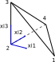

# Principle of Virtual Mechanical Work

## Variational formulation of the principle

ONSAS can be used to solve the set of nonlynear equations given by the Principle of Virtual Work (PVW). The PVW can be defined in terms of the following set of nonlinear equations:

```math
\left(
     \mathbf{f}_{mas}(\mathbf{u}_t, \dot{\mathbf{u}}_t, \ddot{\mathbf{u}}_t)
  +  \mathbf{f}_{vis}(\dot{\mathbf{u}}_t)
  +  \mathbf{f}_{int}(\mathbf{u}_t)
  -  \mathbf{f}_{ext}(t)
\right) \cdot \delta \mathbf{u}
=
0 \qquad \forall \delta \mathbf{u} \in \tilde{\mathcal{U}}
```


## Solid Elements Implementation

### Tetrahedron Solid Element

The tetrahedron element considered is a four-node linear element. The isoparametric coordinates reference element is shown in the following figure



and the linear shape functions are given by
```math
N_1(\xi) = \xi_1 \quad
N_2(\xi) = 1-\xi_1-\xi_2-\xi_3 \quad
N_3(\xi) = \xi_3 \quad
N_4(\xi) = \xi_2
```

The functions can be expressed in vector form
```math
  \textbf{ N } =
  \left[
\begin{matrix}
N_{1} \\
N_{2} \\
N_{3} \\
N_{4}
\end{matrix}
  \right]
```

and the linear interpolation of the coordinates of any point within an element can be written as
```math
\textbf{X} = eleCoordMat . \textbf{N}(\xi)
```
where $eleCoordMat$ is a matrix with the reference configuration coordinates (or material coordinates) of the nodes:
```math
eleCoordMat =
\left[
\begin{matrix}
X_{11}   & X_{12} & X_{13} & X_{14} \\
X_{21}   & X_{22} & X_{23} & X_{24} \\
X_{31}   & X_{32} & X_{33} & X_{34} \\
\end{matrix}
\right]
```
where $X_{ij}$ represents the coordinate in the $i$-th dimension of the $j$-th node.

The displacements gradient tensor is defined as
```math
  \textbf{ H } =
    \frac{ \partial \textbf{ u } }
	 { \partial \textbf{ X } }
	 \qquad
  H_{ij} =  \frac{ \partial u_i } { \partial X_j }
```
and using the displacement interpolation can be written in matrix form as
```math
\textbf{ H } = eleDispsMat . \frac{\partial \textbf{N}}{ \partial \textbf{X}}
```

The material-isoparametric coordinates relation is given by:
```math
\textbf{X} = eleCoordMat .  \textbf{ N }(\xi)
```
and using the chain rule we obtain:
```math
\frac{\partial \textbf{N}}{ \partial \textbf{X}} =
\frac{\partial \textbf{N}}{ \partial \xi } . \frac{\partial \xi }{ \partial \textbf{X} }
```

Then using the inverse theorem we obtain:
```math
\frac{\partial \xi}{ \partial \textbf{X}} = \left( eleCoordMat .  \frac{\partial \textbf{N}}{ \partial \xi } \right)^{-1}
```

```math
\nabla \textbf{u} = eleDispsMat . \left( eleCoordMat .  \frac{\partial \textbf{N}}{ \partial \xi } \right)^{-1}
```
