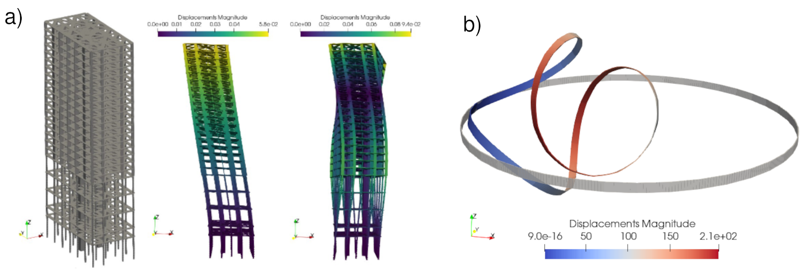

# Summary

The design of structures relies on the computation (or estimation) of the stress and deformation developed by structural elements submitted to external loads. The Finite Element Method (FEM) can be considered the most effective computational tool for structural analysis [@Zienkiewicz1972] with several commercial software being developed since the end of the 20th century. In the last decades new paradigms, such as Building Information Modeling or Parametric Design, have been applied to design in Engineering with increasing attention to openness and automatization. Open-source software (OSS) for structural analysis might represent a relevant asset for researchers and engineers providing solutions in design.

The main goal of the present library is to provide an open implementation of the FEM for nonlinear structural analysis problems. The library allows any non-expert user to solve static or dynamic problems considering highly nonlinear phenomena such as large rotations and/or nonlinear dynamics. The mathematical formulations implemented are based on relevant references, from classical textbooks [@Bathe1982;@Crisfield1997] to recent journal articles [@Battini2002;@Le2014]. Finally, the library can be executed in any platform supporting GNU-Octave/MATLAB, allowing its integration it with other software in the analysis/design process.

# Statement of need

As mentioned above, new innovative and open standards, such as BIM [@IFC] or SAF [@SAF], have emerged in the Engineering Design industries, allowing OSS to be more easily integrated in workflows. Most of OSS FEM software are aimed to efficiently solve general continuum-domain problems without natively considering structural elements [@freefem;@fenics]. For structural analysis, libraries such as [@FEAP;@opensees] or more recently [@cubens], can be found. However their code is written in Fortran, C or C++, which represents a limitation for graduate students or researchers whose expertise and user experience is focused on Octave/Matlab. A structural analysis library in Octave/Matlab could provide a considerable group of Engineering professionals and academics, software tools that are: easy-to-use, extendable and free (to use and inspect).

The library presented in this article, called Open Nonlinear Structural Analysis Solver (`ONSAS`), and its development started in 2017. Graduate students of a Nonlinear Structural Analysis course taught at the School of Engineering of _Universidad de la República_ in Uruguay, were introduced to the mathematical formulation of the Principle of Virtual Work (PVW), and its numerical resolution methods for truss structures. The set of functions and scripts developed was published in the course book [@anle].

The posterior development of the code was mostly motivated by the research projects that users worked on, and as the complexity of the problems posed increased, nonlinear analysis of frame structural elements became needed. In 2019 an implementation of the co-rotational formulation for nonlinear static analysis [@Battini2002] was contributed by Prof. Battini. During 2022 a consistent co-rotational formulation for dynamic analysis [@Le2014] was implemented. To the best knowledge of the authors this library represents the first open implementation of the cited dynamic co-rotational formulation. By the end of 2022 the nonlinear dynamic co-rotational formulation was applied to include aerodynamic loads in frames, allowing to solve a new set of modeling problems such as wind turbine aerodynamic analysis [@mauri]. More recently a Vortex-Induced Vibrations model for fluid-structure interaction was included [@villie]. Currently, in the context of two Master theses, a nonlinear shell element formulation and a formulation for plastic analysis of frames considering softening hinges are being implemented.

# Features and examples

The library allows to solve static or dynamic structural analysis problems considering truss, frame, plate, plane or solid elements. The mathematical formulation is based on the PVW [@Crisfield1997], thus a system of global balance equations is assembled:
$$
\left( \textbf{f}_{int} (\textbf{u}_t) %
+ \textbf{f}_{vis} (\dot{\textbf{u}}_t)  %
+ \textbf{f}_{ine} (\textbf{u}_{t}, \dot{\textbf{u}}_t, \ddot{\textbf{u}}_t )
\right) \cdot \delta \textbf{u}  %
= \left(  \textbf{f}_{ext,t} + \textbf{f}_{ext,add} (\textbf{u}_{t}, \dot{\textbf{u}}_t) \right) \cdot \delta \textbf{u}
\quad \forall \delta \textbf{u} \in \mathcal{U}
$$
where $\textbf{f}_{int}$ and $\textbf{f}_{vis}$ are the vector of internal static and damping forces, $\textbf{f}_{ext,t}$ is the vector of external forces, $\textbf{f}_{ext,add}$ is the vector of external additional forces (caused by different external agents) that can be set by the user and $\textbf{f}_{ine}$ the vector of inertial forces. The vectors $\textbf{u}_t$, $\dot{\textbf{u}}_t$ and $\ddot{\textbf{u}}_t$, represent the displacements, velocities and accelerations of all the degrees of freedom of the structure at time $t$, respectively.

For the numerical time integration, `ONSAS` includes built-in nonlinear solution strategies, such as the Newton-Raphson and the Arc-Length methods, for static analyses, and the Newmark and the $\alpha$-HHT methods for transient dynamic analyses. Linear modal analysis is available for frame and truss elements. For solid elements, it is possible to compute the tangent matrix associated with the internal forces by using the complex-step approach presented in [@kiran]. For planar frame structures it is also possible to perform plastic analyses considering softening hinges as described in [@jukic].

The tool also allows the users to: import meshes from the open-source meshing software GMSH [@GMSH], and export results as VTK files for visualization using open-source tools such as Paraview [@ParaView]. In \autoref{fig} subfigure a) a modal analysis deformation is shown, while in subfigure b) the deformation of a deployable ring problem, introduced in [@yoshi], showing the ability of `ONSAS` to solve large displacements and rotations problems.

`ONSAS` was also applied in [@forets] for the computation of mass and stiffness FEM matrices for the resolution of wave propagation and heat transfer problems using 2D triangular plane elements.  Finally, the current development of the library is mostrly focused on adding plastic analysis of frame elements, adding magnitudes to the generated visualization. 

# Acknowledgements

The authors would like to thank Professor Jean-Marc Battini for contributing functions for computing the static forces of the co-rotational frame element. Also the authors would like to thank Dr. Marcelo Forets, who made contributions in the application of automated documentation generation tools, and MSc. Eng. Santiago Correa, who made contributions to examples such as beamLinearVibration and specific contributions to the code. The contributions of the authors are globally described in a file in the repository.

The development of `ONSAS` has been partially supported by funds provided by the following agencies/projects: _Agencia Nacional de Investigación e Innovación_ of Uruguay (via project VIOLETA, code FSE_1_2016_1_131837, manager, Prof. Gabriel Usera), _Natural Sciences and Engineering Research Council_ of Canada (thanks to support by Prof. Frédérick Gosselin) and _Comisión Sectorial de Investigación Científica_ (CSIC) of Uruguay (via project I+D_2019, manager, Prof. Pérez Zerpa) and _Comisión Sectorial de Enseñanza_ of Uruguay (project: _Rediseño de prácticas de enseñanza y evaluación en Resistencia de Materiales_, manager, Prof. Pérez Zerpa).

# References
