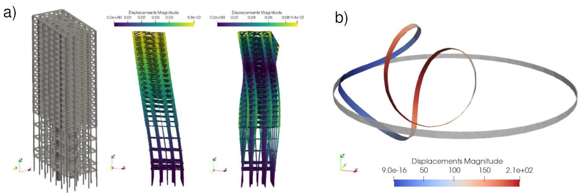

# Summary

The design of structures relies on the computation (or estimation) of the stress and deformation developed by structural elements subjected to external loads. The Finite Element Method (FEM) can be considered the most effective computational tool for structural analysis [@Zienkiewicz1972], with several commercial software packages being developed since the end of the 20th century. In recent decades, new paradigms such as Building Information Modeling or Parametric Design have been applied to engineering design, with increasing attention to openness and automation. Open-source software (OSS) for structural analysis might represent a relevant asset for researchers and engineers providing solutions in design.

The main goal of the present library is to provide an open implementation of the FEM for nonlinear structural analysis problems. The library allows any non-expert user to solve static or dynamic problems considering highly nonlinear phenomena such as large rotations and/or nonlinear dynamics. The mathematical formulations implemented are based on relevant references, from classical textbooks [@Crisfield1997] to recent journal articles [@Battini2002;@Le2014]. Finally, the library can be executed on any platform supporting GNU-Octave/MATLAB, allowing its integration with other software in the analysis/design process.

# Statement of need

As mentioned above, new innovative and open standards, such as BIM [@IFC] or SAF [@SAF], have emerged in the engineering design industries, allowing OSS to be more easily integrated in workflows. Most OSS FEM software is aimed at efficiently solving general continuum-domain problems without natively supporting structural elements [@freefem;@fenics]. For structural analysis, libraries such as FEAP [@FEAP], OpenSees [@opensees] or CU-BENs [@cubens], can be found. FEAP is a general-purpose finite element analysis program designed for research and educational use, allowing the solution of problems with linear, surface, and volume elements, including contact and mesh generation, among other features. OpenSees is a software framework for developing applications to simulate the performance of structural and geotechnical systems subjected to earthquakes. Community developments have added features such as fluid-structure interaction and a Python interface.

The core code of the tools mentioned above is written in Fortran, C, or C++, which represents a limitation for graduate students or researchers whose experience is focused on scripting languages. Structural analysis libraries developed using Octave/Matlab or Python could represent a more suitable choice for Engineering professionals, students, or academics who need to solve problems with certain complex structural behaviors as well as being able to inspect the code and the formulations implemented.

Among the available tools, PyElastica [@PyElastica] can be highlighted, since it is a Python library for simulating assemblies of slender, one-dimensional structures using Cosserat Rod theory. It can model large deformations, include hinges, and also solve problems including contact between slender elements. The tool focuses on one-dimensional elements and does not support the analysis of solid, plane, or shell elements, which are common in structural engineering applications.

The development of the library presented in this article, called Open Nonlinear Structural Analysis Solver (`ONSAS`), started in 2017. In this course, graduate students of a Nonlinear Structural Analysis course taught at the School of Engineering of _Universidad de la República_ in Uruguay are introduced to the mathematical formulation of the Principle of Virtual Work (PVW) and its numerical resolution methods for truss structures. The initial subset of functions and scripts was published in the course book by @anle.

Subsequent development of the code was mostly motivated by the research projects that users worked on, and as the complexity of the problems posed increased, nonlinear analysis of frame structural elements became necessary. In 2019, an implementation of the co-rotational formulation for nonlinear static analysis  presented by @Battini2002, was contributed by Prof. Battini. During 2022, the consistent co-rotational formulation for dynamic analysis presented by @Le2014 was implemented. To the best knowledge of the authors, this library represents the first open implementation of the cited dynamic co-rotational formulation. By the end of 2022, the nonlinear dynamic co-rotational formulation was applied to include aerodynamic loads in frames, allowing the solution of a new set of modeling problems such as wind turbine aerodynamic analysis, as shown by @mauri. More recently, a Vortex-Induced Vibrations model for fluid-structure interaction was included and applied in @villie. Currently, in the context of a Master's theses, a nonlinear shell element formulation is being implemented.

# Features and examples

The library allows users to solve static or dynamic structural analysis problems considering truss, frame, plate, plane, or solid elements. The mathematical formulation is based on the PVW [@Crisfield1997], thus a system of global balance equations is assembled:
$$
\left( \textbf{f}_{int} (\textbf{u}_t) %
+ \textbf{f}_{vis} (\dot{\textbf{u}}_t)  %
+ \textbf{f}_{ine} (\textbf{u}_{t}, \dot{\textbf{u}}_t, \ddot{\textbf{u}}_t )
\right) \cdot \delta \textbf{u}  %
= \left(  \textbf{f}_{ext,t} + \textbf{f}_{ext,add} (\textbf{u}_{t}, \dot{\textbf{u}}_t) \right) \cdot \delta \textbf{u}
\quad \forall \delta \textbf{u} \in \mathcal{U}
$$
where $\textbf{f}_{int}$ and $\textbf{f}_{vis}$ are the vectors of internal static and damping forces, $\textbf{f}_{ext,t}$ is the vector of external forces, $\textbf{f}_{ext,add}$ is the vector of external additional forces (caused by different external agents) that can be set by the user, and $\textbf{f}_{ine}$ is the vector of inertial forces. The vectors $\textbf{u}_t$, $\dot{\textbf{u}}_t$, and $\ddot{\textbf{u}}_t$ represent the displacements, velocities, and accelerations of all the degrees of freedom of the structure at time $t$, respectively.

For the numerical time integration, `ONSAS` includes built-in nonlinear solution strategies, such as the Newton-Raphson and the Arc-Length methods, for static analyses, and the Newmark and the $\alpha$-HHT methods for transient dynamic analyses. Linear modal analysis is available for frame and truss elements. For solid elements, it is possible to compute the tangent matrix associated with the internal forces by using the complex-step approach presented in @kiran. For planar frame structures it is also possible to perform plastic analyses considering softening hinges as described in @jukic, while for plane triangular elements elasto-plastic analyses based on [@deSouzaNeto2008] are also available.

The tool also allows users to import meshes from the open-source meshing software GMSH [@GMSH] and export results as VTK files for visualization using open-source tools such as Paraview [@ParaView]. In \autoref{fig}, a) shows a modal analysis deformation, while b) shows the deformation of a deployable ring problem, introduced in @yoshi, demonstrating the ability of `ONSAS` to solve large displacement and rotation problems.

`ONSAS` was also applied by @forets for the computation of mass and stiffness FEM matrices for the resolution of wave propagation and heat transfer problems using 2D triangular plane elements.

# Acknowledgements

The authors would like to thank Professor Jean-Marc Battini for contributing functions for computing the static forces of the co-rotational frame element. The authors would also like to thank Dr. Marcelo Forets, who made contributions in the application of automated documentation generation tools, and MSc. Eng. Santiago Correa, who made contributions to examples such as `beamLinearVibration` and specific contributions to the code. The contributions of the authors are globally described in a file in the repository.

The development of `ONSAS` has been partially supported by funds provided by the following agencies/projects: _Agencia Nacional de Investigación e Innovación_ of Uruguay (via project VIOLETA, code FSE_1_2016_1_131837, manager, Prof. Gabriel Usera), _Natural Sciences and Engineering Research Council_ of Canada (thanks to support by Prof. Frédérick Gosselin) and _Comisión Sectorial de Investigación Científica_ (CSIC) of Uruguay (via project I+D_2019, manager, Prof. Pérez Zerpa) and _Comisión Sectorial de Enseñanza_ of Uruguay (project: _Rediseño de prácticas de enseñanza y evaluación en Resistencia de Materiales_, manager, Prof. Pérez Zerpa).

# References
